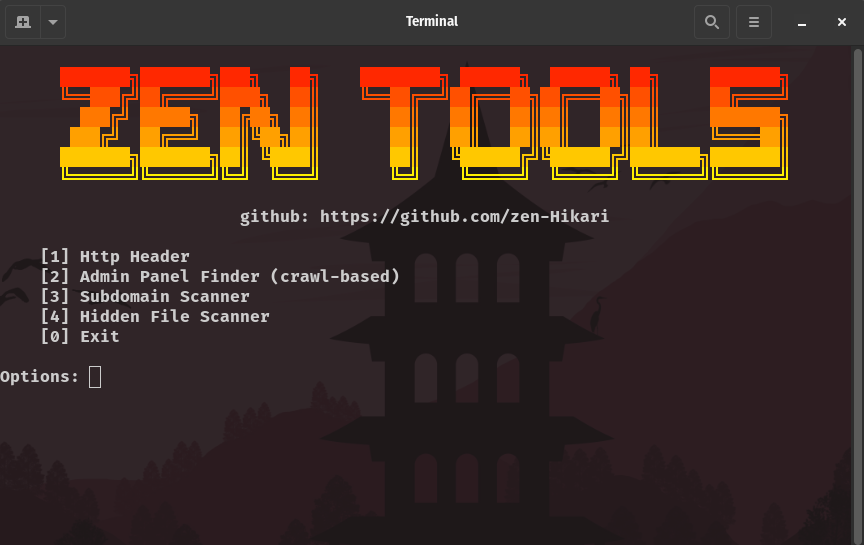

**Zen_Tools** is a multipurpose information security toolkit written in Python. It is designed for penetration testers, bug bounty hunters, and cybersecurity enthusiasts to simplify common reconnaissance tasks.

## Features

✅ HTTP Header Viewer  
✅ Admin Panel Finder (crawl-based)  
✅ Subdomain Scanner with extended wordlist  
✅ Hidden File and Directory Scanner  
✅ Modern colorful terminal interface  
✅ Easy to use and extend

## Screenshots
<p align="center">
  
</p>


## Installation

Make sure you have **Python** installed.  
Then clone the repository:

```bash
git clone https://github.com/zen-Hikari/Zen_TOOLS
cd Zen_TOOLS
